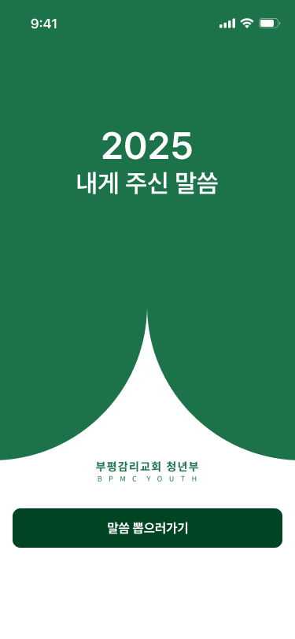
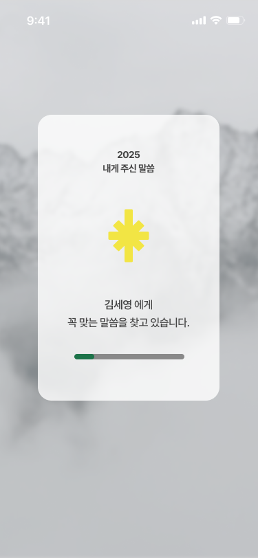
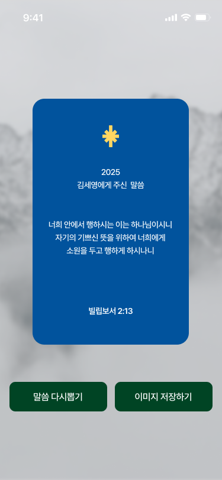
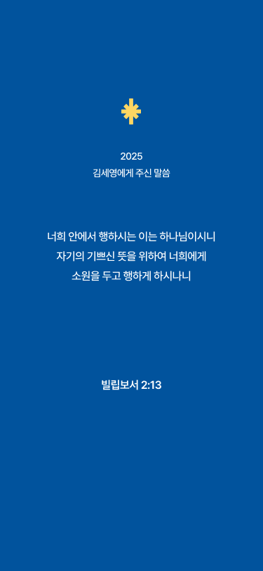

# 2025 Bible Card 😇


> 부평감리교회 청년부 말씀 온라인 말씀 뽑기! ➡️ (http://bpmcyouth.ddns.net)


## Description
부평감리교회 청년부에서 오프라인으로 진행했던 카드 뽑기를 온라인에서 뽑을 수 있도록 청년부 디자인팀에서 기획하였다.

부평감리교회 청년부의 로고와 아이콘을 조화롭게 사용하여 이쁜 말씀 카드를 모바일에서 다운로드 할 수 있도록 개발 하였다.

많은 청년들이 본인에게 맞는 말씀 카드를 뽑고, 뽑은 말씀을 통해 위로와 사랑을 얻기 바란다.


## 🎨 디자인 기획
### 화면 플로우
<p float="left">
  
  
  
  
</p>

### 최종 다운로드 이미지
<p>
  
</p>

## Stack
- **Design**: Figma
- **Language**: HTML5, CSS3, Javascript
- **Deploy**: Docker

## :open_file_folder: Project Structure
```markdown
bpmcBible
├── css
├── js
├── data
├── images
│   ├── demo
│   └── card
└── index.html
```

## 🧑‍💻Developer👩‍💻
*  **김제원** ([je1kim]([https://](https://github.com/je1kim)))
*  **김예빈** ([yekong082]([https://](https://github.com/yekong812)))
